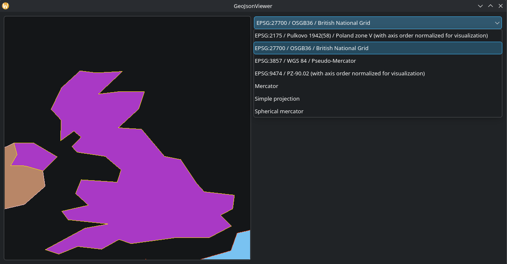

# LatteProj

A [proj](https://github.com/OSGeo/PROJ) extension for [LatteLong](https://github.com/pandazz77/LatteLong)



[Check out Example](examples/main.cpp)

## Dependencies
- LatteLong > 0.2.0
- Proj (at the moment tested only on 9.7.0)

## Installation
```bash
mkdir build
cd build
cmake .. -DBUILD_EXAMPLES=OFF DBUILD_TESTS=OFF
sudo cmake --build . -j 4 --config Release --target install
```
now you will be able to access library with CMake:

find_package(LatteLong REQUIRED COMPONENTS LatteProj)
target_link_libraries(YourProject LatteLong::LatteLong LatteLong::LatteProj)

OR you can pass installation and use library simply by adding this directory with cmake:

```cmake
add_subdirectory(./LatteLong)
```